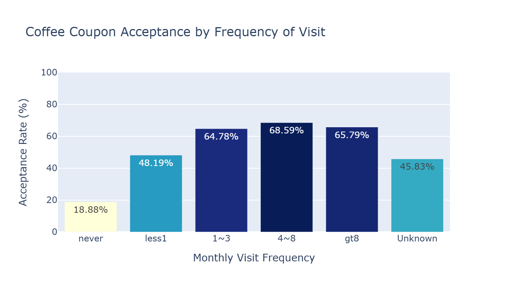
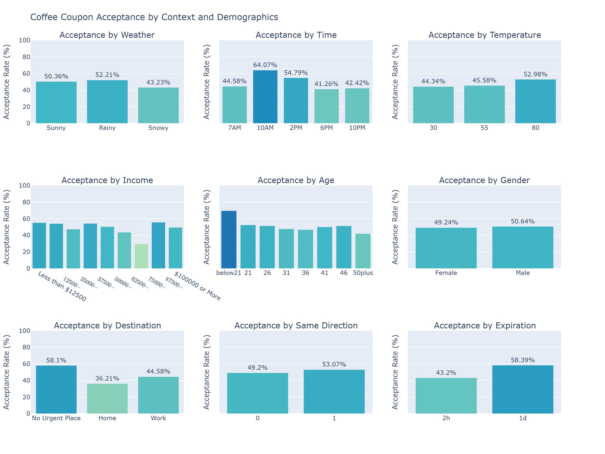

Berkeley AI/ML course assignment, coupon analysis

**Problem statement:**

Different types of coupons are sent to the driver's by mobile. How to determine if a driver is likely to accept the coupon? What are the factors that determine acceptance of coupon?

**Dataset**

The data is from the UCI Machine Learning repository and was collected through a survey on Amazon Mechanical Turk. The survey describes different driving scenarios including the destination, current time, weather, passenger, etc., and then ask the person whether they will accept the coupon if they are the driver.
Answers that the user will drive there ‘right away’ or ‘later before the coupon expires’ are labeled as ‘Y = 1’ and answers ‘no, I do not want the coupon’ are labeled as ‘Y = 0’.

There are five different types of coupons -- less expensive restaurants (under \$20), Coffee Houses, Carry out & take away, Bar, and more expensive restaurants (\$20 - $50). The dataset provides various user and contextual attributes.

**Link to notebook:**
https://github.com/aravSpark/berkeley-ml-coupons/blob/main/prompt.ipynb

**Findings and observations:**

**Analysis of Bar coupons:**

- Overall acceptance of bar coupons is 41%.
- Frequently bars visitors (over 3 times a month) show higher acceptance of 77%
- Drivers who go to bars at least once a month have high acceptance rate.
- Drivers travelling without kids and not widowed have an acceptance rate of 71%
- Younger drivers (under 30 years) who visit bar at least once a month show a high acceptance of 72%

The observations suggest that life style factors and habits, especially frequency of visits to bar, is a strong indicator of bar coupon acceptance. Also younger drivers are more likely to accept bar coupons.

Next steps:
Targeting frequent bar visitors will likely increase acceptance rate of bar coupons above 41%. Among frequent bar visitors, targeting the younger drivers should further increase the likelihood of acceptance.
 

**Analysis of coffee coupon:**

- Overall acceptance of Coffee House coupon is 50%, slightly higher than the 41% acceptance of bar coupons
- Drivers who visit coffee house at least once a month have higher acceptance rate compared to those who never visit.
- Increasing visit frequency beyond once a month does not significantly increase acceptance
  - 1 to 3 times: 65%
  - 4 to 8 times 69%
  - More than 8 time:66%
- Weather and temperature show minimal impact on acceptance rate
- Destination has an impact on acceptance 
   - Without urgency show higher acceptance (58%)
   - Heading home (36%)
   - Heading to work (45%)
- Age is an important factor, younger drivers especially those below 21 have the highest acceptance rate (70%), while 50+ group has lowest (42%)

Driver's life style and habits, especially frequency of visits and age are primary determinants of Coffee House coupon acceptance. Environmental factors does not have much influence on acceptance rate. Urgency of travel have some moderate impact on acceptance rate.

Next steps:
To increase acceptance rate, focus on drivers who already visit coffee houses regularly. Additionally, Target younger drivers and those without urgent travel plans.
